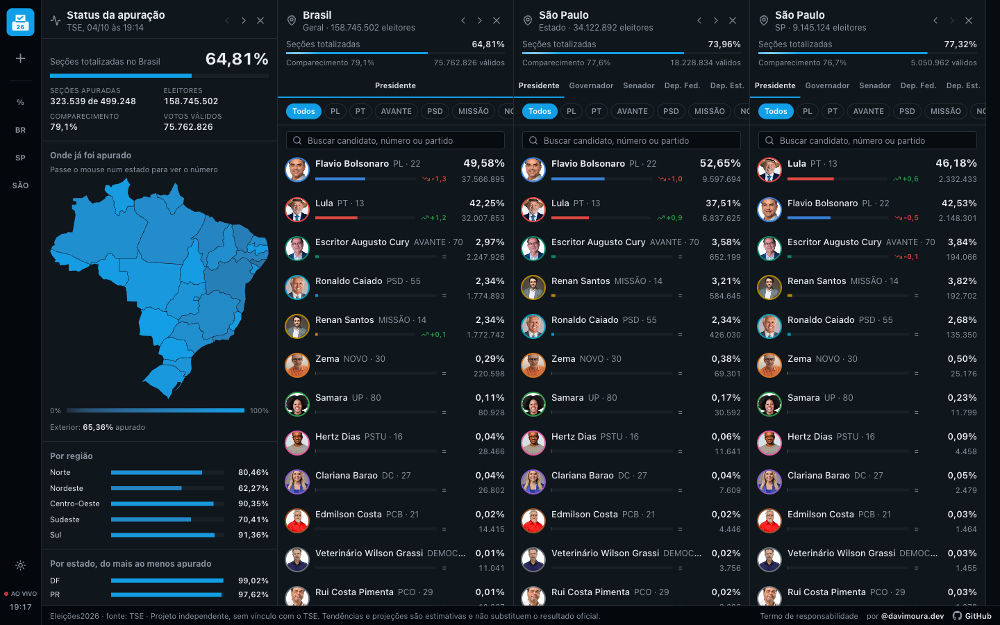
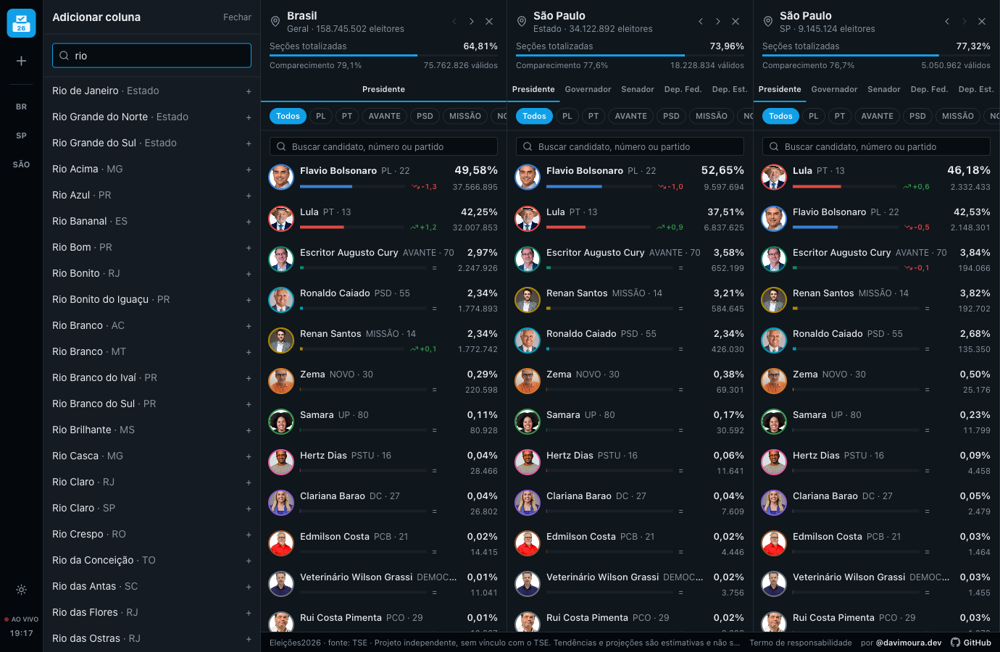
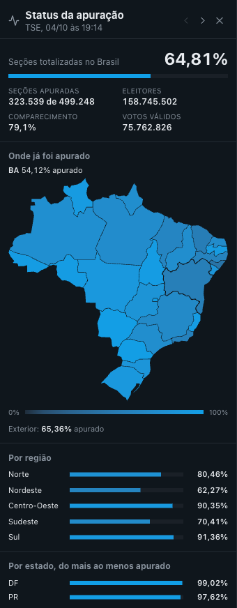
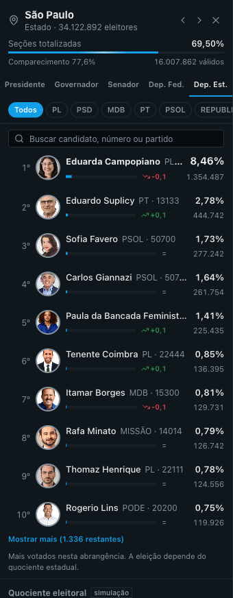
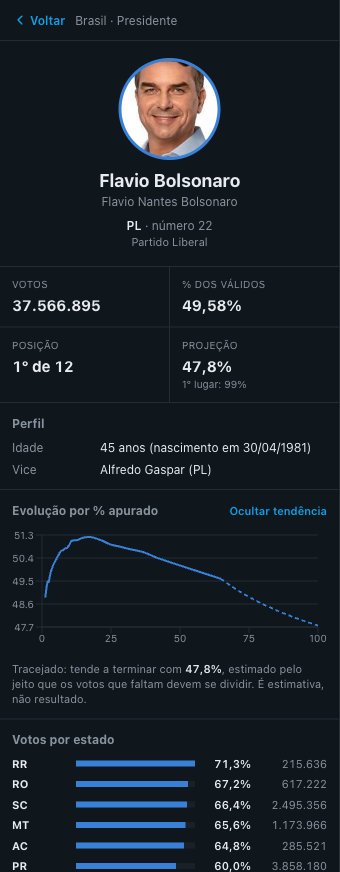
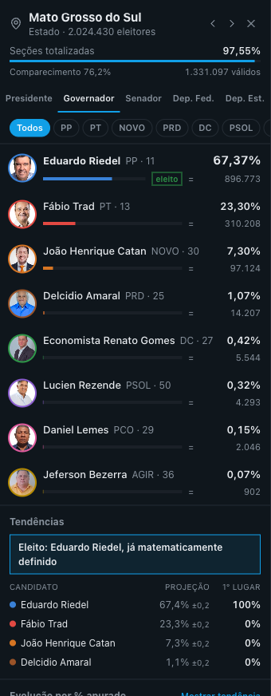
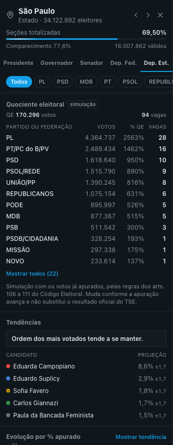
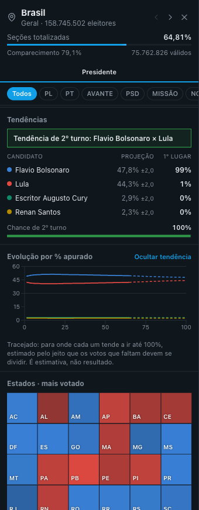
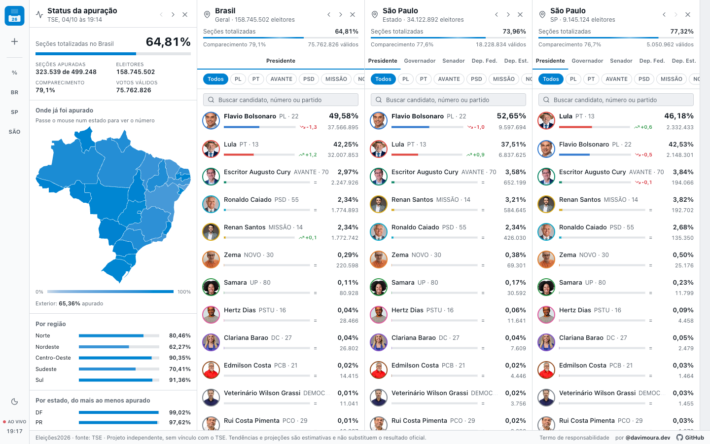

# Eleições2026

A apuração das eleições de 2026 em colunas lado a lado, no estilo TweetDeck.
Você escolhe o que quer acompanhar - o Brasil, um estado, a sua cidade - e cada um vira uma coluna que se atualiza sozinha.

No ar em **[eleicoes2026-ashy.vercel.app](https://eleicoes2026-ashy.vercel.app)**.



## O que dá pra fazer

### Uma coluna pra cada lugar

Clica no **+** da barra lateral e busca por qualquer estado ou município do Brasil, ou por uma cidade do exterior onde tem brasileiro votando.
São 5.785 lugares.
Cada um vira uma coluna, e dá pra abrir quantas quiser, mudar a ordem pelas setinhas e fechar no **x**.

O site lembra das suas colunas.
Fechou a aba e voltou depois, tá tudo lá, do jeito que você deixou.



### Status da apuração

É a coluna que mostra o andamento geral da contagem, não quem tá ganhando.

- Quantas seções eleitorais do Brasil já foram contadas, de quantas no total.
- O comparecimento - quanto do eleitorado das seções já contadas foi votar.
- Um mapa onde cada estado fica mais forte conforme avança a contagem. Passa o mouse num estado pra ver o número.
- O mesmo por região e um ranking dos estados, do mais ao menos apurado.



### O placar

Em cada coluna tem uma aba por cargo: Presidente, Governador, Senador, Deputado Federal e Deputado Estadual (Distrital, no DF).
A coluna do Brasil só tem Presidente, porque é o único cargo votado no país todo.

Pra cada candidato aparece a foto, o partido, o número, a porcentagem dos votos válidos e o total de votos.
A setinha verde ou vermelha mostra se ele subiu ou caiu nas últimas atualizações.
A cor segue o partido, do jeito que todo mundo reconhece: PT vermelho, PL azul, Missão amarelo, NOVO laranja.
Ela não muda quando alguém passa outro candidato.

- **Filtro por partido:** os botões logo acima da lista mostram só os candidatos daqueles partidos.
- **Busca:** dá pra procurar por nome, número ou partido, sem se preocupar com acento.
- **Mostrar mais:** as listas de deputado começam nos 10 mais votados. Em São Paulo são mais de 1.300 candidatos a deputado estadual, então dá pra ir abrindo de 50 em 50.



### A página do candidato

Clica em qualquer candidato e a coluna vira a página dele.
Tem o nome completo, o partido, a idade, a coligação ou federação, o vice ou os suplentes, a posição, os votos e um gráfico de como ele foi indo ao longo da contagem.

Na coluna do Brasil ainda aparece como o presidenciável tá em cada estado, com os estados onde ele lidera em negrito.
O **Voltar** (ou a tecla Esc) devolve a coluna exatamente como tava.



### Tendências

Com uma parte das urnas contadas, a gente estima onde cada um deve terminar.

- **Projeção:** a porcentagem que o candidato deve ter no fim. No Brasil, ela leva em conta quanto falta contar em cada estado, porque um estado que ainda não apurou nada muda muito o resultado.
- **Margem:** o "±" do lado da projeção. Ela começa grande e vai diminuindo conforme a contagem avança.
- **Chance de 1º lugar:** quantas vezes, em 400 simulações, o candidato termina na frente. No Senado são duas vagas, então a coluna vira "chance de ser eleito".
- **2º turno:** pra Presidente e Governador, a chance de ninguém passar de 50% dos votos válidos.

Isso é estatística, não resultado.
Quando o TSE marca alguém como eleito ou como indo pro 2º turno, o site para de estimar e mostra o que o TSE disse.

Tem um caso em que dá pra cravar antes do TSE: quando nem todos os votos que faltam apurar mudam o resultado.
A conta é pelo pior cenário: todo mundo das seções que faltam vai votar, e vota no adversário.
Se mesmo assim o líder continua com mais da metade dos votos válidos, ele já tá eleito, e o site mostra isso.
No Senado é igual: o candidato tá eleito se continua na frente do primeiro que tá fora das vagas, mesmo que esse leve todos os votos restantes.
Isso só vale onde a eleição acontece de verdade - Presidente no Brasil, Governador e Senador no estado.
Ganhar o Presidente num estado não elege ninguém.



### Quociente eleitoral

Deputado não ganha só por ser dos mais votados.
As vagas primeiro são divididas entre os partidos e federações, conforme os votos de cada um, e só depois vão pros candidatos mais votados de cada partido.
A conta que faz essa divisão se chama quociente eleitoral.

Na aba de deputado da coluna de um estado, o site faz essa conta com os votos já apurados e mostra quantas vagas cada partido levaria se a apuração parasse agora.
Quando a contagem termina, troca pela divisão oficial do TSE.

A conta segue o Código Eleitoral do jeito que vale em 2026, com as mudanças de 2021 e a decisão do STF de 2024.
A gente testou contra o resultado oficial de todas as 5.547 cidades com a contagem de vereador de 2024 finalizada, e o resultado bateu em todas.
A versão de 2024 deste projeto errava a divisão em uma de cada três cidades.



### Evolução e atualizações

O gráfico de evolução mostra a porcentagem de cada candidato conforme a contagem avança.

O botão **Mostrar tendência** desenha, tracejado, pra onde cada linha tende a ir até 100%.
Não é esticar a linha: a conta estima como os votos que faltam devem se dividir e soma isso ao que cada um já tem.
No Brasil, ela olha estado por estado o quanto falta apurar e como cada um vem votando.
Nos estados e cidades, ela usa como foram os votos apurados por último, que mostram o perfil das urnas que tão chegando.
O ponto final do tracejado é a mesma projeção da tabela de tendências.
Na coluna do Brasil ainda tem o mapa dos estados, pintado com a cor de quem tá na frente em cada um - quanto mais forte, mais apurado.
Embaixo fica um resumo do que aconteceu: quando a apuração passou de 10%, 25%, 50% e assim por diante, e quando alguém passou outro candidato.



### Modo claro e ao vivo

O botão de sol e lua, embaixo na barra lateral, troca entre o modo escuro e o claro.
Logo abaixo dele, o ponto vermelho com "AO VIVO" mostra que a conexão tá de pé, e o horário é o da última atualização que saiu do TSE.



## De onde vêm os números

Tudo vem dos arquivos públicos de resultado do TSE, os mesmos que alimentam o site oficial.

Em 2024 eu fiz uma versão disso em que cada navegador consultava o TSE direto.
Com bastante gente olhando e apertando F5, o TSE começou a bloquear por excesso de acessos.

Agora é diferente.
Um servidor nosso confere o TSE a cada poucos segundos, guarda os resultados e manda pra todo mundo ao mesmo tempo.
O seu navegador nunca fala com o TSE, então não importa quanta gente tá olhando ou quantas vezes você recarrega.
Na prática, um número novo aparece aqui segundos depois de sair no TSE.

## Aviso

Este é um projeto independente, sem nenhum vínculo com o TSE, com a Justiça Eleitoral, com partidos ou com candidatos.
Tendências, projeções, chances e a simulação do quociente são estimativas e não substituem o resultado oficial.
O resultado que vale é o divulgado pela Justiça Eleitoral.

## Pra quem quer rodar o código

O front é TanStack Start com React, publicado na Vercel.
O backend é Supabase: Postgres pros resultados e o histórico, Edge Functions pra consultar o TSE e Realtime pra mandar as atualizações.

- `supabase/functions/poll-tse` roda a cada 5 segundos pelo `pg_cron`. Ele usa requisições condicionais ao CDN do TSE, divide o trabalho entre workers e descarta respostas de servidores do CDN que ainda tão com uma versão antiga do arquivo.
- `supabase/functions/watch` entrega o estado atual e o histórico quando alguém abre uma coluna, e marca aquela disputa como acompanhada.
- Cada lugar tem um canal no Realtime (`abr:<lugar>`), e o Presidente de todos os estados tem um canal só (`pres-uf`).
- `supabase/functions/_shared/tse.ts` é TypeScript puro, usado pelas functions, pelo app e pelos testes.

```sh
bun install
cp .env.example .env
bun run dev
```

Outros comandos:

- `bun run test` roda os testes, que usam arquivos reais do TSE em `src/lib/election/__fixtures__/`.
- `bun run lint` roda o ESLint e o Prettier.
- `bun scripts/validate-quociente.ts 6000` compara o cálculo do quociente com o resultado oficial de 2024 em todas as cidades. Leva uns 8 minutos.
- `bun scripts/gen-places.ts` regenera a lista de lugares a partir da configuração do TSE.
- `bun scripts/gen-brazil-map.ts` regenera o mapa dos estados (as instruções estão no próprio arquivo).
